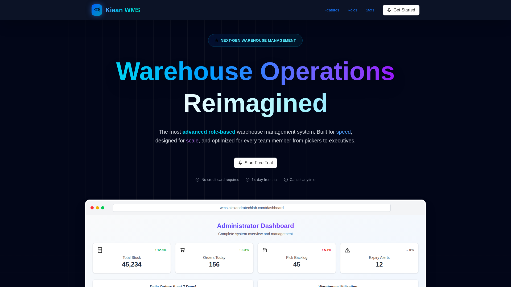
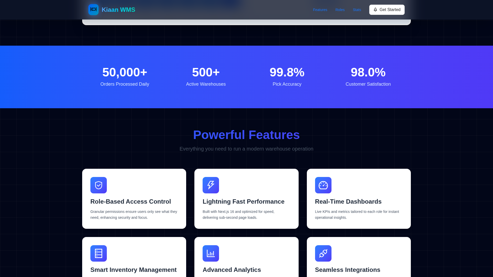
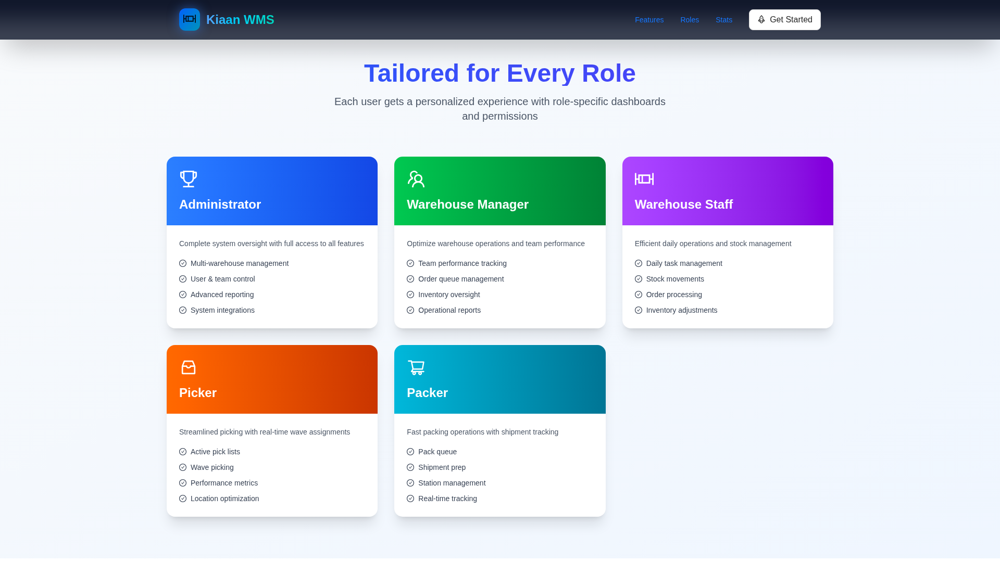
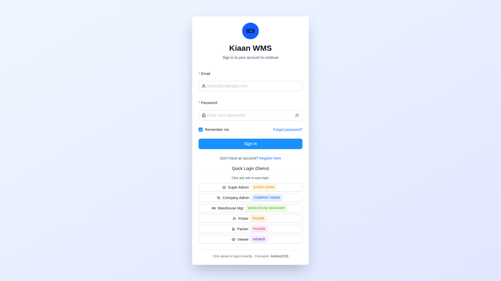
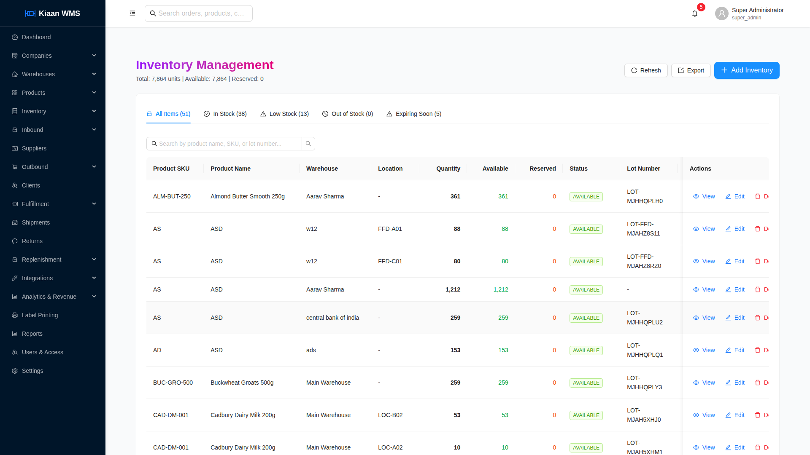
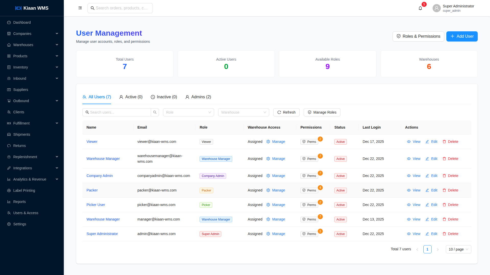
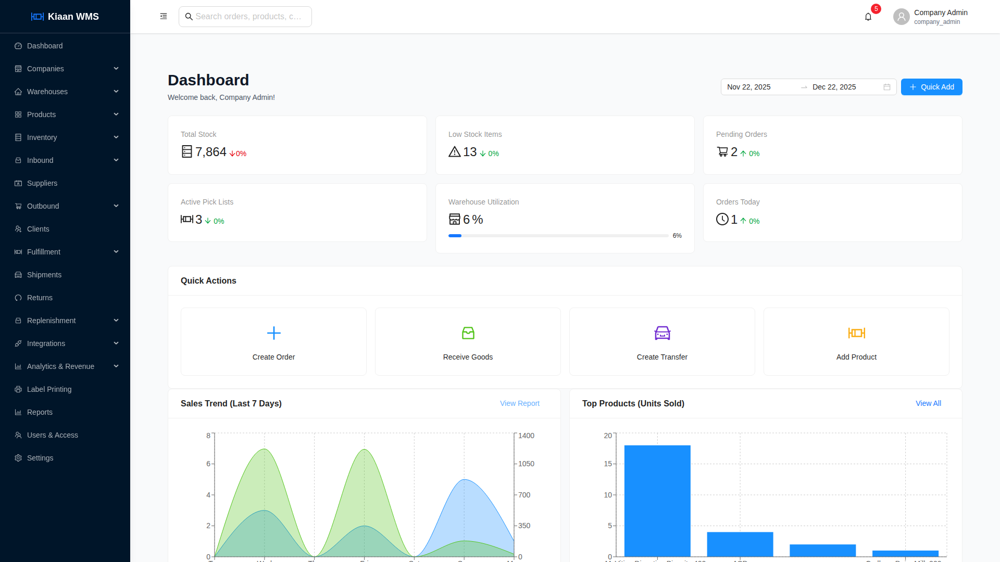
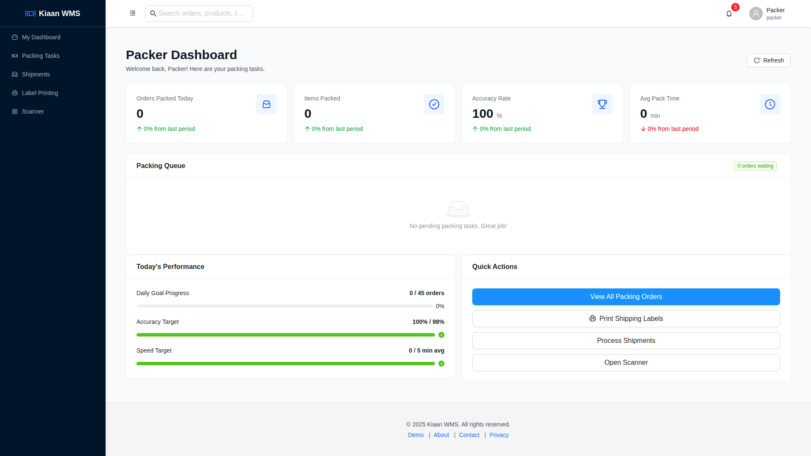
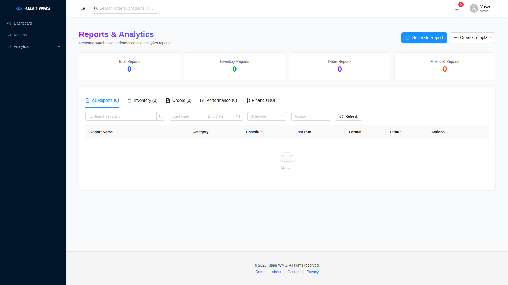

# Kiaan WMS - Complete User Guide

**Kiaan Warehouse Management System** is a comprehensive, role-based platform for managing warehouse operations. This guide covers all features from the landing page through each role-specific dashboard.

**Access URL:** https://wms.alexandratechlab.com

---

## Table of Contents

1. [Getting Started](#1-getting-started)
2. [Landing Page](#2-landing-page)
3. [Authentication](#3-authentication)
4. [Super Admin Dashboard](#4-super-admin-dashboard)
5. [Company Admin Dashboard](#5-company-admin-dashboard)
6. [Warehouse Manager Dashboard](#6-warehouse-manager-dashboard)
7. [Picker Dashboard](#7-picker-dashboard)
8. [Packer Dashboard](#8-packer-dashboard)
9. [Viewer Dashboard](#9-viewer-dashboard)
10. [Common Features](#10-common-features)

---

## 1. Getting Started

### System Requirements

- Modern web browser (Chrome, Firefox, Safari, Edge)
- Screen resolution: 1280x720 minimum (1920x1080 recommended)
- Stable internet connection

### Accessing the System

1. Open browser and navigate to: **https://wms.alexandratechlab.com**
2. Click "Get Started" or go to: **https://wms.alexandratechlab.com/auth/login**
3. Select your role or enter credentials
4. You'll be directed to your role-specific dashboard

### User Roles Overview

| Role | Access Level | Primary Functions |
|------|--------------|-------------------|
| **Super Admin** | Full system | All features, multi-company management |
| **Company Admin** | Company-wide | User management, configuration |
| **Warehouse Manager** | Warehouse-wide | Operations, reports, team management |
| **Picker** | Picking tasks | Pick lists, inventory locations |
| **Packer** | Packing tasks | Pack orders, shipping labels |
| **Viewer** | Read-only | View reports and dashboards |

---

## 2. Landing Page

### Hero Section



The landing page features a modern, professional design with:

**Main Elements:**
- **Animated Background** - Dynamic gradient effects
- **Hero Title** - "Warehouse Operations Reimagined"
- **Tagline** - "The most advanced role-based warehouse management system"
- **Trial Benefits:**
  - No credit card required
  - 14-day free trial
  - Cancel anytime

**Navigation:**
- Features - Platform capabilities
- Roles - User role information
- Stats - Performance metrics
- Get Started - Login button


### Features Section



**Core Features:**

| Feature | Description |
|---------|-------------|
| **Role-Based Access Control** | Granular permissions for each user type |
| **Lightning Fast Performance** | Built with Next.js for sub-second page loads |
| **Real-Time Dashboards** | Live KPIs tailored to each role |
| **Smart Inventory Management** | Track stock, batches, serial numbers, expiry dates |
| **Advanced Analytics** | Comprehensive reports and insights |
| **Seamless Integrations** | Connect with Amazon, Shopify, eBay via API |


### Roles Section



**Available Roles:**

- **Administrator** - Complete system oversight, user management
- **Manager** - Team oversight, reporting, operational decisions
- **Supervisor** - Floor operations, task assignment
- **Picker** - Order picking, inventory location
- **Packer** - Order verification, packaging
- **Receiver** - Inbound goods, quality inspection

---

## 3. Authentication

### Login Page



### Login Options

**Manual Login:**
1. Enter Email Address
2. Enter Password
3. (Optional) Check "Remember me"
4. Click "Sign In"

**Quick Demo Login:**
The login page provides quick access buttons for testing different roles:
- Super Admin
- Company Admin
- Warehouse Manager
- Picker
- Packer
- Viewer

### Form Fields

| Field | Description |
|-------|-------------|
| **Email** | Your registered email (e.g., admin@example.com) |
| **Password** | Your secure password |
| **Remember me** | Stay logged in on this device |

### Password Recovery

Click "Forgot password?" to reset your password via email.

---

## 4. Super Admin Dashboard


### Overview

The Super Admin has complete system access across all companies and features.

**Dashboard Metrics:**

| Metric | Description |
|--------|-------------|
| **Total Stock** | Current inventory count across all warehouses |
| **Orders Today** | Daily order volume with trend indicator |
| **Pick Backlog** | Orders waiting in the pick queue |
| **Expiry Alerts** | Products approaching expiration date |

### Charts & Visualizations

**Daily Orders Chart:**
- 7-day order trend visualization
- Bar chart showing daily volumes
- Color-coded current day

**Warehouse Utilization:**
- Circular gauge showing capacity usage
- Percentage of warehouse space utilized
- Clear visual of available space

### Navigation Menu

The sidebar provides access to all modules:
- Dashboard - Main overview
- Inventory - Stock management
- Orders - Order processing
- Picking - Pick operations
- Packing - Pack and ship
- Shipping - Carrier management
- Reports - Analytics
- Users - User management
- Settings - Configuration


### Inventory Management




### Order Management


### User Management




---

## 5. Company Admin Dashboard



### Overview

The Company Admin manages operations within their assigned company.

**Key Responsibilities:**
- User management for the company
- Warehouse configuration
- Operational reporting
- System settings

**Dashboard Features:**
- Company-specific metrics
- User activity overview
- Warehouse performance
- Alert management

---

## 6. Warehouse Manager Dashboard


### Overview

The Warehouse Manager oversees daily operations and team performance.

**Key Functions:**
- Monitor warehouse KPIs
- Manage picking and packing teams
- Track order fulfillment
- Generate operational reports
- Handle exceptions

**Dashboard Metrics:**
- Orders in progress
- Pick completion rate
- Team productivity
- Shipping status

**Management Tools:**
- Task assignment
- Performance tracking
- Workload balancing
- Exception handling

---

## 7. Picker Dashboard


### Overview

The Picker interface is optimized for efficient order picking operations.

**Main Features:**
- Active pick list display
- Optimized pick path routing
- Item scanning verification
- Quantity confirmation
- Location guidance

**Picking Workflow:**

1. **Receive Assignment** - Get pick list from queue
2. **Navigate to Location** - Follow guided path
3. **Locate Item** - Find in designated bin
4. **Scan/Verify** - Confirm correct item
5. **Pick Quantity** - Take required amount
6. **Confirm** - Mark item as picked
7. **Continue** - Move to next item
8. **Complete** - Finish pick list

**Performance Tracking:**
- Items picked today
- Pick accuracy rate
- Time per pick
- Distance traveled

---

## 8. Packer Dashboard



### Overview

The Packer interface streamlines order packing and shipping preparation.

**Main Features:**
- Orders ready to pack queue
- Item verification checklist
- Box/packaging selection
- Label printing
- Shipping integration

**Packing Workflow:**

1. **Select Order** - Choose from ready queue
2. **Verify Items** - Confirm all items present
3. **Select Packaging** - Choose appropriate box
4. **Pack Items** - Secure items in box
5. **Add Documents** - Include packing slip
6. **Print Label** - Generate shipping label
7. **Apply Label** - Attach to package
8. **Stage** - Move to shipping area

**Packing Stats:**
- Orders packed today
- Average pack time
- Accuracy rate
- Packages by carrier

---

## 9. Viewer Dashboard



### Overview

The Viewer role provides read-only access to system data and reports.

**Access Level:**
- View dashboards and reports
- No edit or create permissions
- Ideal for stakeholders and auditors

**Available Views:**
- Inventory status
- Order tracking
- Performance reports
- Historical data

---

## 10. Common Features

### Inventory Management

**Stock Operations:**

| Operation | Description |
|-----------|-------------|
| **Receive** | Accept incoming inventory |
| **Putaway** | Store in designated locations |
| **Pick** | Retrieve for orders |
| **Pack** | Package for shipping |
| **Ship** | Dispatch to carrier |
| **Adjust** | Correct quantities |
| **Transfer** | Move between locations |

### Order Management

**Order Workflow:**

```
New → Allocated → Picking → Picked → Packing → Packed → Shipped → Delivered
```

**Order Statuses:**

| Status | Description |
|--------|-------------|
| **New** | Just received |
| **Allocated** | Stock reserved |
| **Picking** | Being picked |
| **Picked** | Items collected |
| **Packing** | Being packed |
| **Packed** | Ready to ship |
| **Shipped** | With carrier |
| **Delivered** | Complete |

### Reports

**Available Reports:**
- Inventory Summary
- Order Volume
- Pick Performance
- Pack Efficiency
- Shipping Analysis
- User Activity

### Settings

**Configuration Areas:**
- Company information
- Warehouse setup
- User management
- Integrations
- Notifications
- Label formats

---

## Quick Reference

### Keyboard Shortcuts

| Shortcut | Action |
|----------|--------|
| **Esc** | Close modal |
| **Enter** | Submit form |
| **Tab** | Next field |

### Support

For assistance:
- Use in-app help (? icon)
- Contact system administrator
- Check documentation

---

*Kiaan WMS - Streamlining warehouse operations for modern businesses.*
