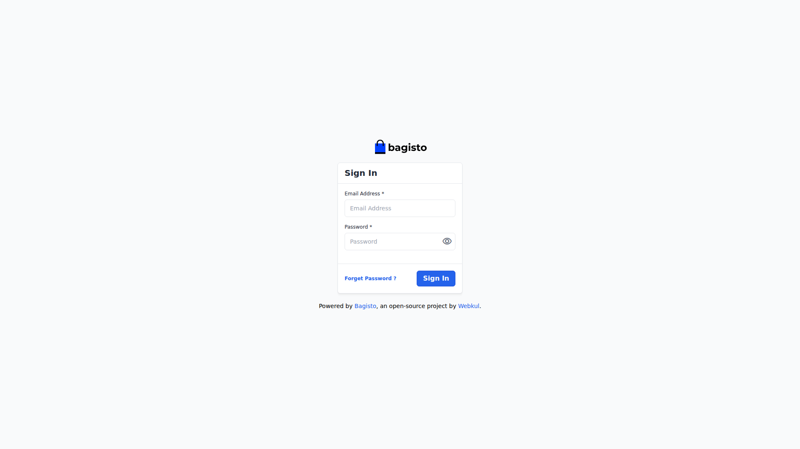
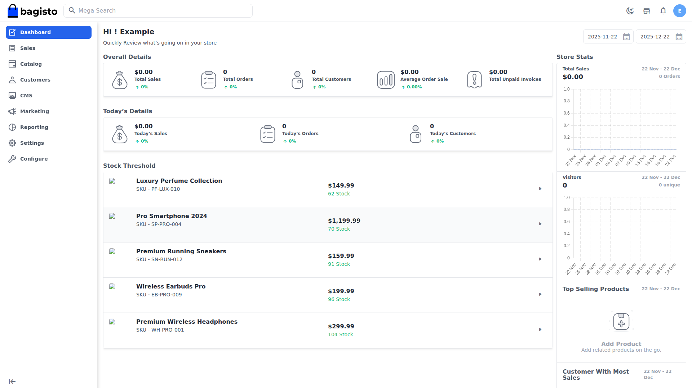
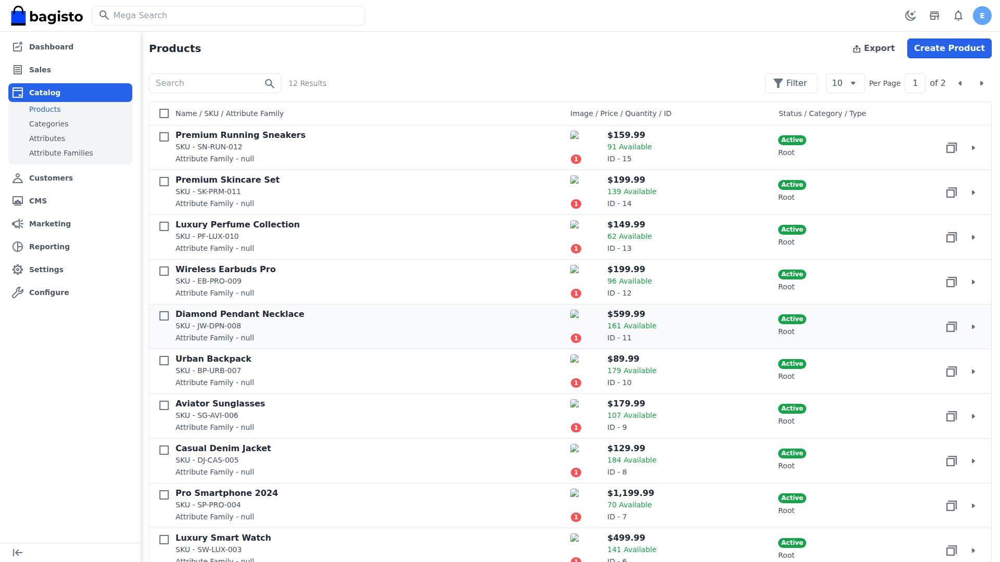
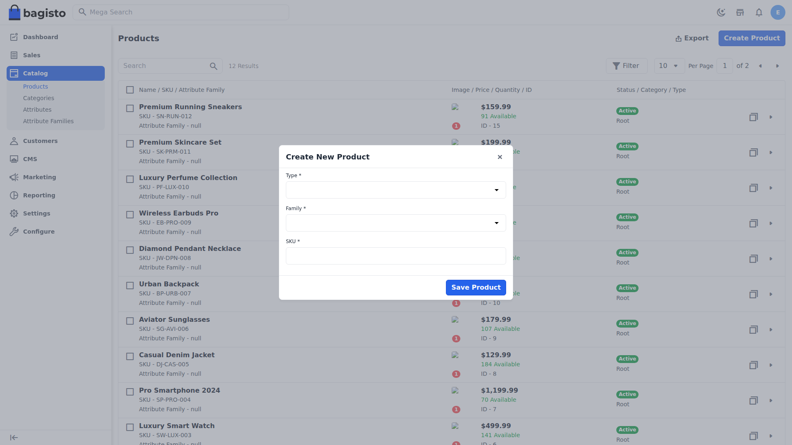
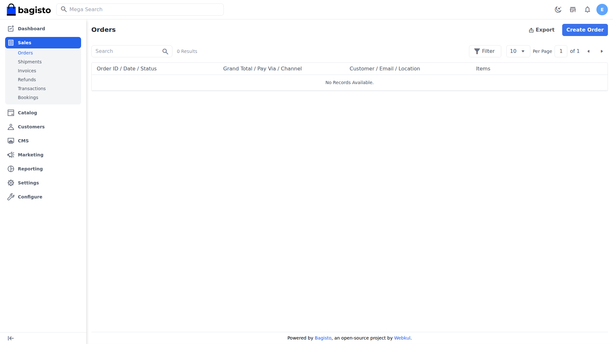
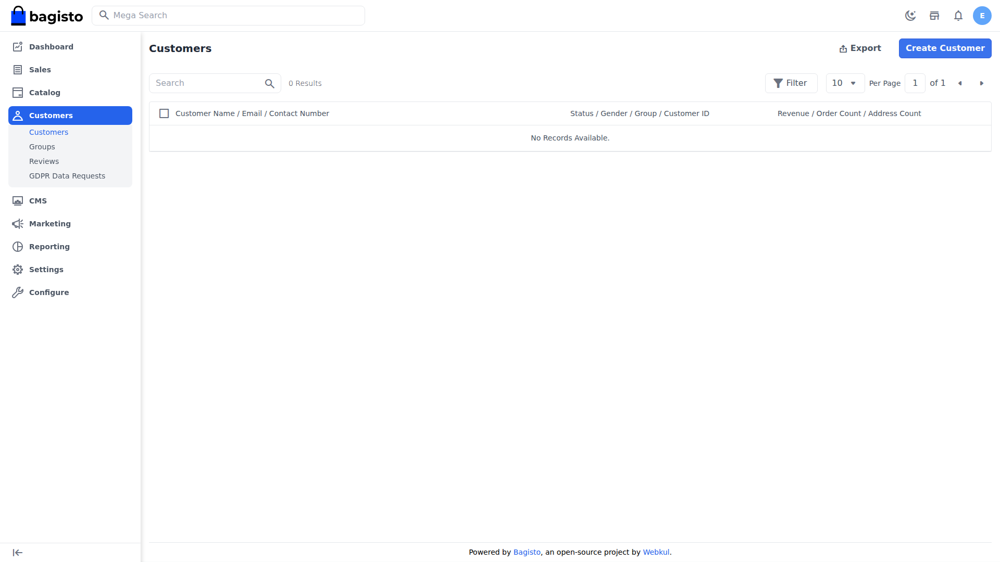
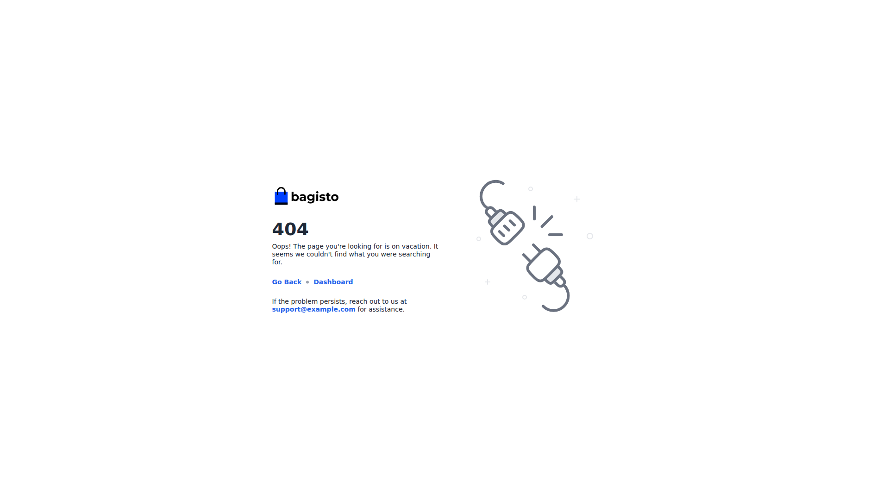
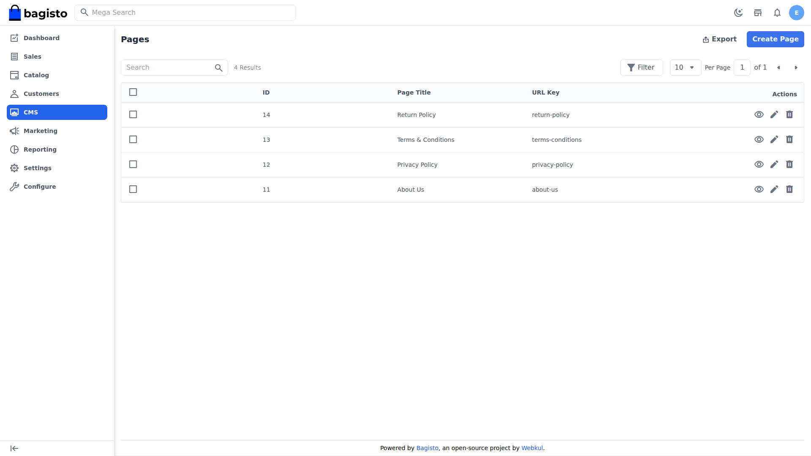

# Kiaan WMS - Complete User Guide

This comprehensive guide covers all features and functionality of the Kiaan Warehouse Management System (WMS) Admin Panel.

**Platform:** Bagisto E-commerce with WMS capabilities
**Access URL:** http://91.98.157.75:8000/admin

---

## Table of Contents
1. [Authentication & Login](#1-authentication--login)
2. [Dashboard Overview](#2-dashboard-overview)
3. [Catalog Management](#3-catalog-management)
4. [Sales & Orders](#4-sales--orders)
5. [Customer Management](#5-customer-management)
6. [Marketing](#6-marketing)
7. [CMS Pages](#7-cms-pages)
8. [Settings & Configuration](#8-settings--configuration)
9. [Reporting](#9-reporting)

---

## 1. Authentication & Login

### Accessing the Admin Panel

The WMS admin panel is accessed at: `http://91.98.157.75:8000/admin/login`

### Login Screen Features

This screen provides secure access to the warehouse management system:

| Element | Purpose |
|---------|---------|
| **Email Address Field** | Enter your administrator email |
| **Password Field** | Enter your secure password |
| **Sign In Button** | Submit credentials to access the system |
| **Forget Password Link** | Reset your password if forgotten |

### How to Login

1. Navigate to the admin URL in your browser
2. Enter your registered administrator email address
3. Enter your password (case-sensitive)
4. Click **Sign In** to access the dashboard

### Security Best Practices

- Use strong, unique passwords (12+ characters with mixed case, numbers, symbols)
- Never share login credentials
- Log out when leaving the workstation
- Use the "Forget Password" feature if you suspect credential compromise

---

## 2. Dashboard Overview

The dashboard provides a centralized view of your warehouse operations.

### Dashboard Components

The main dashboard displays key business metrics and quick-access features:

**Metrics Cards** - At-a-glance statistics including:
- Total Orders (Today/This Month/Lifetime)
- Revenue figures
- Customer count
- Product inventory status

**Recent Activity** - Latest orders and system events

**Sales Charts** - Visual representation of sales trends

### Navigation Menu

The left sidebar provides access to all system modules:

| Module | Function |
|--------|----------|
| **Dashboard** | Overview and key metrics |
| **Catalog** | Products, Categories, Attributes |
| **Sales** | Orders, Invoices, Shipments, Refunds |
| **Customers** | Customer accounts and groups |
| **Marketing** | Promotions, Campaigns, Communications |
| **CMS** | Content pages management |
| **Settings** | System configuration |
| **Configuration** | Advanced settings |

### Using the Dashboard

1. **Monitor KPIs** - Check daily sales and order volume
2. **Review Alerts** - Address low stock or pending orders
3. **Quick Actions** - Access frequently used features
4. **Analyze Trends** - Use charts to identify patterns

---

## 3. Catalog Management

The catalog module manages your product inventory, categories, and attributes.

### Products List

This screen displays all products in your inventory:

**Features:**
- **Product Grid/Table** - View all products with images, names, SKUs, prices
- **Search** - Find products by name, SKU, or other attributes
- **Filters** - Narrow results by category, status, type, price range
- **Bulk Actions** - Apply changes to multiple products
- **Create Product** - Add new items to inventory

### Product Table Columns

| Column | Description |
|--------|-------------|
| **Checkbox** | Select for bulk actions |
| **Image** | Product thumbnail |
| **SKU** | Unique Stock Keeping Unit |
| **Name** | Product title |
| **Attribute Family** | Product type classification |
| **Status** | Active/Inactive |
| **Price** | Current selling price |
| **Quantity** | Stock on hand |
| **Actions** | Edit, Delete options |

### Adding a New Product

1. Click **Create Product** button
2. Select **Attribute Family** (determines available fields)
3. Enter **SKU** (unique identifier)
4. Fill product details:
   - General: Name, Description, URL Key
   - Price: Base price, Special price, Cost
   - Images: Upload product photos
   - Inventory: Stock quantity, availability
   - Categories: Assign to categories
   - SEO: Meta title, description, keywords

### Product Types

| Type | Use Case |
|------|----------|
| **Simple** | Basic single products |
| **Configurable** | Products with variants (size, color) |
| **Virtual** | Digital/downloadable products |
| **Grouped** | Bundle of simple products |
| **Bundle** | Customizable product packages |

### Editing Products

1. Click the **Edit** icon on the product row
2. Modify any fields as needed
3. Click **Save Product** to apply changes

### Managing Categories

Categories organize products for easier navigation:

- **Create Category** - Add new product groupings
- **Hierarchy** - Set parent/child relationships
- **Attributes** - Assign filterable attributes
- **SEO** - Category meta information

---

### Product Creation Form

**Form Sections:**

1. **Product Selection**
   - Choose product type (Simple, Configurable, etc.)
   - Select attribute family for field configuration

2. **General Information**
   - Product Name - Main title displayed to customers
   - SKU - Unique stock keeping unit code
   - URL Key - SEO-friendly URL slug
   - Status - Active/Inactive toggle

3. **Pricing**
   - Price - Base selling price
   - Special Price - Discounted price (optional)
   - Cost - Your cost (for profit calculations)

4. **Images**
   - Base Image - Main product photo
   - Gallery - Additional product images
   - Drag & drop upload supported

5. **Inventory**
   - Quantity - Stock on hand
   - Stock Availability - In Stock / Out of Stock

6. **SEO**
   - Meta Title - Search engine title
   - Meta Description - Search result snippet
   - Meta Keywords - Search terms

## 4. Sales & Orders

Manage customer orders from placement through fulfillment.

### Orders Overview

The orders screen displays all transactions:

**Table Columns:**
- **Order ID** - Unique order number
- **Date** - Order placement date/time
- **Customer** - Buyer name and email
- **Status** - Current order state
- **Total** - Order amount
- **Channel** - Sales channel source
- **Actions** - View, Edit options

### Order Statuses

| Status | Meaning | Action Required |
|--------|---------|-----------------|
| **Pending** | New order received | Process payment |
| **Pending Payment** | Awaiting payment | Wait for payment |
| **Processing** | Payment confirmed | Prepare shipment |
| **Completed** | Order fulfilled | None |
| **Cancelled** | Order cancelled | Review reason |
| **Closed** | Fully processed | None |

### Processing an Order

1. **Review Order** - Click order to view details
2. **Verify Items** - Confirm products and quantities
3. **Create Invoice** - Generate payment record
4. **Create Shipment** - Record shipping details
5. **Complete Order** - Mark as fulfilled

### Order Detail View

Each order shows:
- Customer billing/shipping addresses
- Ordered items with images and prices
- Payment method and status
- Shipping method selected
- Order comments and history

### Creating Invoices

1. Open order detail
2. Click **Create Invoice**
3. Verify quantities to invoice
4. Add comments if needed
5. Submit invoice

### Creating Shipments

1. Open order detail
2. Click **Create Shipment**
3. Enter tracking number
4. Select carrier
5. Confirm shipment

### Refunds

For returns and refunds:
1. Open completed order
2. Click **Create Refund**
3. Select items and quantities
4. Enter refund amount
5. Process refund

---

## 5. Customer Management

Manage customer accounts, groups, and relationships.

### Customer List Features

- **Search** - Find customers by name, email, phone
- **Filters** - Filter by status, group, date
- **Export** - Download customer data
- **Create Customer** - Add new accounts manually

### Customer Information

| Field | Description |
|-------|-------------|
| **ID** | System identifier |
| **Name** | Full customer name |
| **Email** | Primary contact email |
| **Phone** | Contact number |
| **Group** | Customer category |
| **Status** | Active/Inactive |
| **Created** | Registration date |

### Customer Details

View comprehensive customer profile:
- Contact information
- Address book (billing/shipping)
- Order history
- Wishlist items
- Reviews submitted

### Customer Groups

Organize customers for targeted marketing:

| Group | Purpose |
|-------|---------|
| **Guest** | Unregistered shoppers |
| **General** | Standard registered customers |
| **Wholesale** | Bulk buyers with special pricing |
| **VIP** | Premium customers |

### Creating Customer Groups

1. Go to Customers > Groups
2. Click **Create Group**
3. Enter group name
4. Set group-specific settings
5. Save group

---

## 6. Marketing

Create promotions, campaigns, and customer communications.

### Marketing Tools

| Tool | Purpose |
|------|---------|
| **Cart Rules** | Shopping cart discounts |
| **Catalog Rules** | Product-level promotions |
| **Email Templates** | Automated communications |
| **Campaigns** | Scheduled promotions |

### Creating Cart Rules (Discounts)

Cart rules apply discounts at checkout:

1. Click **Create Cart Rule**
2. **General Settings**
   - Name the promotion
   - Set description
   - Enable/disable
   - Priority order

3. **Conditions**
   - Cart subtotal minimum
   - Specific products
   - Customer groups
   - Coupon code (optional)

4. **Actions**
   - Discount type (%, fixed, free shipping)
   - Discount amount
   - Maximum discount cap

### Coupon Codes

Create promotional codes:
- Single-use or multi-use
- Per-customer limits
- Expiration dates
- Tracking and reporting

### Email Campaigns

Reach customers with targeted emails:
- New product announcements
- Sale notifications
- Abandoned cart reminders
- Order follow-ups

---

## 7. CMS Pages

Manage static content pages for your store.

### CMS Features

- **Page List** - View all content pages
- **Create Page** - Add new static pages
- **Edit Content** - Modify existing pages
- **Publish Control** - Enable/disable pages

### Common CMS Pages

| Page | Purpose |
|------|---------|
| **About Us** | Company information |
| **Contact** | Contact form and details |
| **Privacy Policy** | Data handling policies |
| **Terms & Conditions** | Legal terms |
| **FAQ** | Frequently asked questions |
| **Shipping Info** | Delivery information |
| **Returns** | Return policy |

### Creating a CMS Page

1. Click **Create Page**
2. Enter page title
3. Set URL key (slug)
4. Add content using rich text editor
5. Configure SEO settings
6. Set status and save

### Content Editor Features

- Text formatting (bold, italic, headings)
- Lists (bulleted, numbered)
- Links and images
- Tables
- HTML source editing

---

## 8. Settings & Configuration

Configure system preferences and business settings.

### Settings Categories

| Category | Configuration Options |
|----------|----------------------|
| **General** | Store info, locale, currency |
| **Catalog** | Product display, inventory |
| **Sales** | Order processing, checkout |
| **Shipping** | Methods, rates, zones |
| **Payment** | Gateway configuration |
| **Taxes** | Tax rates and rules |
| **Emails** | Notification settings |

### Store Information

Configure basic store details:
- Store name and logo
- Contact email and phone
- Business address
- Operating hours

### Shipping Methods

Set up shipping options:

| Method | Use Case |
|--------|----------|
| **Flat Rate** | Single price shipping |
| **Free Shipping** | Free delivery over threshold |
| **Table Rate** | Zone-based pricing |

### Payment Methods

Enable payment options:
- Cash on Delivery
- Money Transfer
- PayPal
- Credit Card gateways

### Tax Configuration

Set up tax collection:
- Tax rates by region
- Product tax classes
- Tax calculation rules
- Tax-inclusive/exclusive pricing

### Email Settings

Configure notifications:
- Order confirmation
- Shipping updates
- Account notifications
- Marketing emails

### User Management

Manage admin users:
- Create admin accounts
- Assign roles and permissions
- Enable/disable users

---

## 9. Reporting

Access business analytics and reports.

### Available Reports

| Report | Metrics |
|--------|---------|
| **Sales** | Revenue, orders, average value |
| **Products** | Top sellers, views, stock levels |
| **Customers** | New registrations, top buyers |
| **Tax** | Tax collected by region |

### Running Reports

1. Select report type from menu
2. Set date range (Today, Week, Month, Year, Custom)
3. Apply filters as needed
4. View data in charts/tables
5. Export to CSV if needed

### Key Metrics to Monitor

**Daily:**
- New orders count
- Revenue total
- Low stock alerts

**Weekly:**
- Sales trends
- Top products
- Customer acquisition

**Monthly:**
- Revenue growth
- Inventory turnover
- Customer lifetime value

---

## Quick Reference

### Keyboard Shortcuts

| Shortcut | Action |
|----------|--------|
| **Esc** | Close modal |
| **Enter** | Submit form |
| **Tab** | Next field |

### Daily Workflow

1. Check Dashboard for new orders
2. Process pending orders
3. Review low stock items
4. Respond to customer inquiries
5. Review daily sales

### Getting Help

- Use the search function to find features
- Check tooltips on form fields
- Contact system administrator for access issues

---

*This guide covers the core features of the Kiaan WMS Admin Panel. For advanced configurations, contact your system administrator.*
